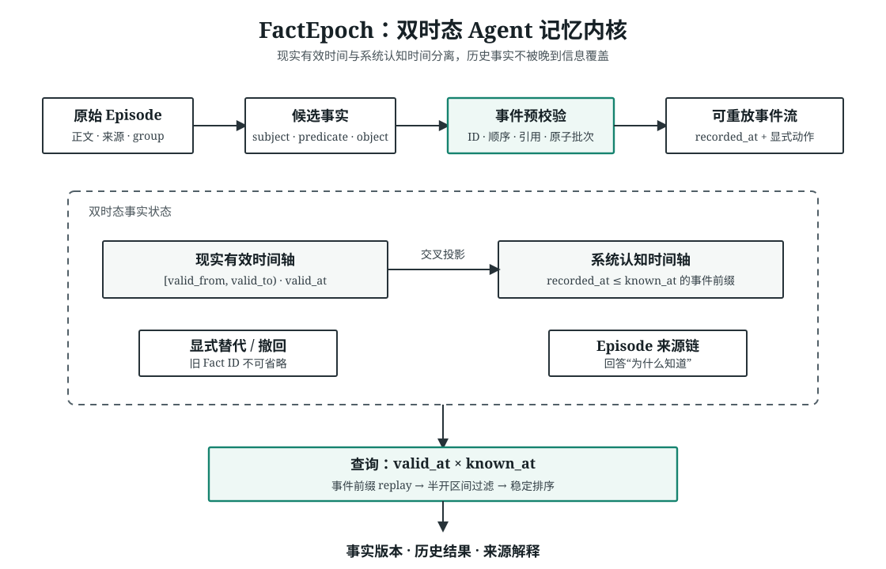

# FactEpoch-mbt

一个只解决一件事的 MoonBit Agent 记忆原型：**把“事情何时成立”和“系统何时知道”分开保存。**



假设 Mira 在时间 `100` 喜欢茶，后来在时间 `180` 才收到一条补充消息：她从时间 `150` 起改喝咖啡。查询同一个现实时间 `160`：

| 查询 | 返回 |
| --- | --- |
| `valid_at=160, known_at=140` | `tea` |
| `valid_at=160, known_at=200` | `coffee` |

这不是缓存刷新，而是两次不同知识边界下的历史重建。

## 先运行看看

```bash
moon test --target all
moon run examples/preference_shift
```

示例输出：

```text
valid_at=160, known_at=140 -> tea
valid_at=160, known_at=200 -> coffee
```

## 目前只有三块

- [`temporal_model.mbt`](temporal_model.mbt)：ID、UTC 毫秒时间、半开区间、Episode、Entity、Fact 与事件信封。
- [`memory_graph.mbt`](memory_graph.mbt)：整批预校验、幂等事件、显式替代/撤回和确定性 replay。
- [`bitemporal_query.mbt`](bitemporal_query.mbt)：`valid_at × known_at` 查询、事实版本历史和来源解释。

代码故意停在能讲清楚、能测试的初赛规模。格式化后核心实现共有 933 行手写 MoonBit 非空源码，另有 195 行测试和 98 行示例；生成接口不计入。

## 为什么不直接用 `updated_at`

`updated_at` 只能告诉你最后改了什么。FactEpoch 的事件同时携带：

- `valid_from`：事实从现实中的哪个时点成立；
- `recorded_at`：系统在哪个时点收到这条信息；
- `source_episode`：判断来自哪段原始材料；
- 显式的旧 Fact ID：替代谁必须由写入方说清楚。

查询会截取 `recorded_at <= known_at` 的事件前缀重新播放，再用 `[valid_from, valid_to)` 过滤。晚到信息因此不会偷偷改写早先的系统认知。

## 这轮没有做

没有数据库、向量检索、LLM 网络适配器、JSONL 持久化、压缩、MCP、REST 或 Web UI。内存结构还是线性查找；在拿到真实使用反馈前，我不想先把存储层做重。

[开发手记](NOTES.md)记录了这次从过宽原型收回三块核心的原因、当前测试薄弱处和下一个可能的切口。[来源说明](docs/upstream.md)记录了 Graphiti 参考版本和没有移植的范围。

## 来源与许可证

项目参考 Graphiti `0.30.1`、commit `547422865cca9fb5a82915c074d899428c145ff4` 对事实有效期、事件时间和显式失效的建模思路，但这里的 API 与实现为 MoonBit 小型重写，不宣称兼容 Graphiti。详见 [`THIRD_PARTY.md`](THIRD_PARTY.md)。

Apache-2.0，见 [`LICENSE`](LICENSE)。

---

English readers: FactEpoch-mbt is a small MoonBit prototype with 933 nonblank lines of handwritten core implementation for bitemporal agent facts. Run `moon test --target all` and `moon run examples/preference_shift`; the design and upstream boundaries are described above and in [`docs/upstream.md`](docs/upstream.md).
